# 🧠 AI Pipeline & Behavioral Analysis Workflow

This document outlines the core backend architecture and AI data pipeline used during a therapy session.

## 1. Data Ingestion (Real-Time WebSocket)
- The child interacts with the frontend activities.
- Real-time video frames (base64) and audio events are streamed to the FastAPI backend via WebSockets (`api.py`).
- The `event_engine.py` intercepts this high-frequency telemetry.

## 2. Feature Extraction (MediaPipe)
Raw frames are passed through the `features/` modules to extract structured biometric data:
- **`eye_features.py`**: Calculates Eye Aspect Ratio (EAR), blink rates, and pupil tracking for gaze aversions.
- **`head_features.py`**: Computes Pitch, Yaw, and Roll for head pose estimation and posture stability.
- **`movement_features.py`**: Tracks wrist and shoulder coordinates.
- **`stimming_features.py`**: Specialized logic for detecting rapid hand oscillation.

## 3. Behavioral Classification
The extracted raw features are fed into our specialized `behavior/` engines:
- **`engagement_analyzer.py`**: Determines if the child is focused on the screen, looking away, or distracted based on head yaw and eye tracking.
- **`repetition_detector.py`**: Analyzes frequency spectrums of wrist movements over a sliding window to detect repetitive behaviors (e.g., hand flapping).
- **`movement_analyzer.py`**: Classifies body rocking by analyzing periodic torso displacement.

## 4. Session Analytics & Dynamic Adaptation
- **`analytics/pattern_engine.py`**: Aggregates behavioral events over the course of the session to identify triggers (e.g., "Hand flapping increases when visual complexity is high").
- **`grow/adaptation_engine.py`**: Using real-time analytics, this engine dynamically adjusts the difficulty or sensory load of the ongoing activity to keep the child in the optimal zone of proximal development.

## 5. Clinical Reporting (AWS Bedrock Integration)
- Upon session completion, `analytics/session_analyzer.py` calculates overall accuracy, latency, and behavioral event totals.
- **`reporting/prompt_builder.py`**: Constructs a specialized LLM prompt injecting the session metrics.
- **`reporting/report_generator.py`**: Calls **AWS Bedrock (Claude)** to generate a comprehensive, clinically formatted narrative report outlining the child's performance, behavioral insights, and future therapy recommendations.

---

## 📊 AI Data Pipeline Diagram

```mermaid
graph LR
    classDef frontend fill:#e1f5fe,stroke:#0288d1,stroke-width:2px;
    classDef ai fill:#fff3e0,stroke:#f57c00,stroke-width:2px;
    classDef logic fill:#e8f5e9,stroke:#388e3c,stroke-width:2px;
    classDef cloud fill:#f3e5f5,stroke:#7b1fa2,stroke-width:2px;

    UI[🖥️ Next.js Activities<br>Camera and Audio Capture]:::frontend
    WS[🌐 WebSocket Server<br>FastAPI 60fps Stream]:::frontend
    
    MP[👁️ MediaPipe Extraction<br>Pose & Landmarks]:::ai
    Beh[🧠 Behavioral Classifier<br>Flapping, Gaze, Posture]:::ai
    
    Adapt[🌱 Adaptation Engine<br>Real-time Game Scaling]:::logic
    Pat[📈 Pattern Engine<br>Session Analytics]:::logic
    
    LLM[☁️ AWS Bedrock<br>Claude Haiku]:::cloud
    Rep[📝 Clinical Report<br>Parent Dashboard]:::cloud

    UI -->|"Base64 Frames"| WS
    WS --> MP
    MP -->|"Raw Coordinates"| Beh
    
    Beh -->|"Behaviors"| Adapt
    Adapt -.->|"Difficulty Feedback"| WS
    WS -.->|"Adjusted Game"| UI
    
    Beh -->|"Event Timestamps"| Pat
    Pat -->|"Metrics"| LLM
    LLM -->|"Generated Summary"| Rep
```

