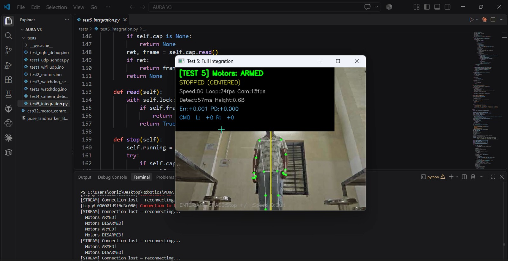

# 📊 Snowie — Dashboard & UI Showcase

A visual walkthrough of the Snowie platform — from onboarding to live behavioral telemetry, child activities, and parent monitoring.

---

## 🔐 Sign Up

> The Sign Up screen where parents or clinicians create a new Snowie account. Clean, accessible form design ensures a smooth onboarding experience.

---

## 🏠 Landing Page

> The Snowie landing page — the first impression of the platform. It introduces Snowie's mission of AI-driven behavioral therapy for children with neurodevelopmental needs.

---

## 📈 Overview Page

> The Overview dashboard gives clinicians and parents a high-level summary of the child's progress — session counts, behavioral trends, and AI-generated insights at a glance.

---

## 🎮 Activity Page

> The Activity hub lists all available child-facing therapeutic games and exercises. Activities are designed to be distraction-free and engaging, targeting skills like attention, imitation, and emotion recognition.

---

## 🟢 Activity 1

> **Activity 1** — An interactive game module that captures real-time biometric telemetry (gaze, posture, blink rate) as the child engages with on-screen stimuli.

---

## 🟡 Activity 2

> **Activity 2** — A follow-the-cue exercise designed to assess imitation behavior and sustained attention. The AI adaptation engine adjusts difficulty in real-time based on the child's cognitive load.

---

## 🔵 Activity 3

> **Activity 3** — An emotion recognition challenge where the child interacts with expressive visual prompts. Behavioral signals are analyzed for appropriate social-emotional responses.

---

## 🟠 Activity 4

> **Activity 4** — A sensory-adjusted engagement module. The grow engine dynamically scales sensory feedback intensity to keep the child within their optimal zone of proximal development.

---

## 🟣 Activity 5

> **Activity 5** — A movement-based interaction task. MediaPipe's hand and body pose landmarks detect repetitive movements (e.g., hand flapping, body rocking) and log behavioral events in real time.

---

## ⚪ Activity 6

> **Activity 6** — An advanced multi-cue activity combining gaze tracking and gesture recognition. Session data feeds into AWS Bedrock (Claude) for automated clinical report generation.

---

## 🤖 Bot Image 1

> **Snowie Bot — View 1.** The friendly Snowie robot companion that guides children through activities. Designed to be approachable and non-intimidating for children with ASD or ADHD.

---

## 🤖 Bot Image 2

> **Snowie Bot — View 2.** An alternate angle of the Snowie robot companion, showing expressive features that help children relate to and follow the bot's cues during therapeutic sessions.

---

## 👨‍👩‍👧 Parent Monitor

> The **Live Parent Monitor** — a real-time dashboard for parents and clinicians. Displays a live video stream alongside behavioral event logs, telemetry graphs, and session state indicators.

---

## 📍 Tracking

> The **Tracking** view provides a longitudinal record of the child's behavioral metrics across sessions. Charts visualize gaze aversion frequency, posture scores, attention span trends, and stimming events — helping clinicians measure therapeutic progress over time.

---

*All screenshots are from the Snowie platform — an AI-driven behavioral tracking and therapy adaptation system built for SIH 2026.*
